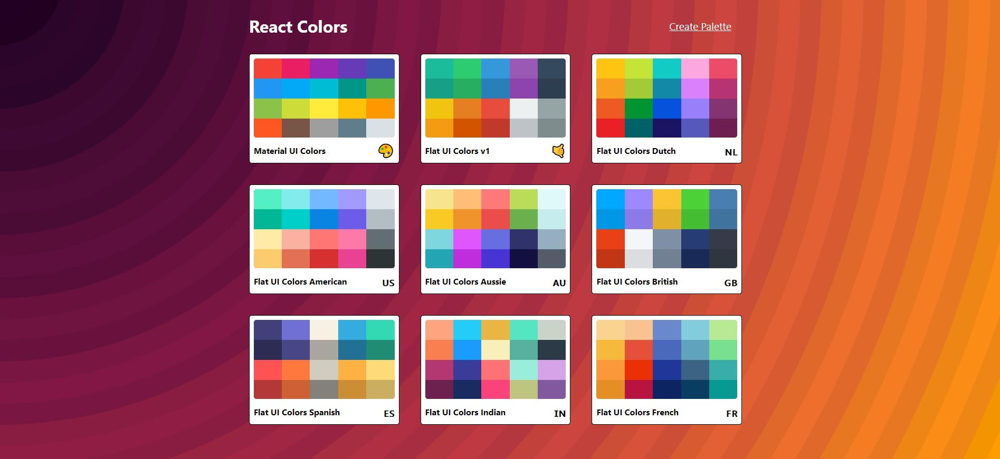
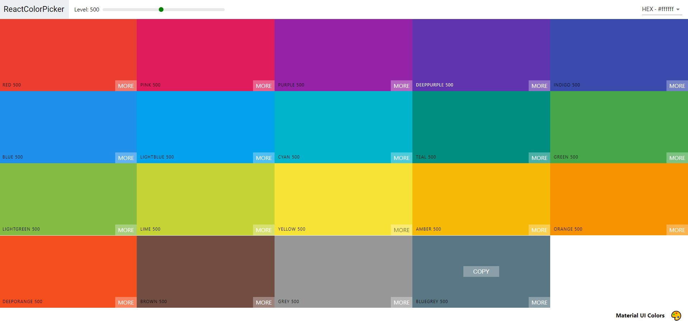
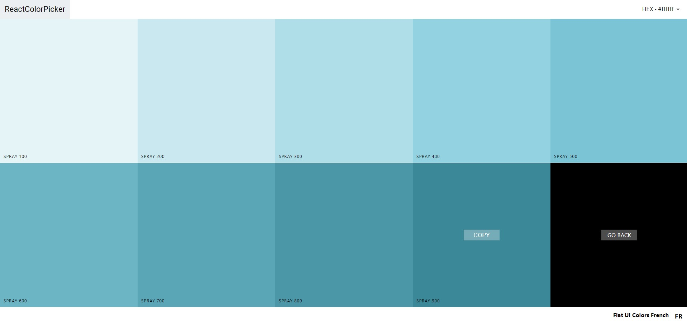
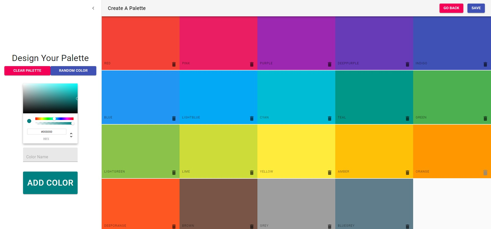

#  Color Picker Website

 

This is a color picker website built with React, Material-UI, and Redux. It allows users to explore and select colors from a curated palette, making it easy to find the perfect color scheme for their projects.


## Prerequisites

Before you begin, ensure you have met the following requirements:

- Node.js and npm installed
- Clone this repository


## Installation

1. Clone the repository:
```
git clone https://github.com/ScaryWings83289/Colors-App.git
cd Colors-App
```

2. Install dependencies:
```
yarn install
```

3. Start the development server:
```
yarn start
```

4. Access the website by navigating to http://localhost:3000 in your web browser.


## Usage

The website allows users to:

- Browse a curated palette of colors.
- Click on a color to view its details, including the HEX and RGB values.
- Copy the color code to their clipboard with a single click.


## Features

Here are some key features of the website:

- React and Material-UI for a responsive and user-friendly interface.
- A curated palette of beautiful colors inspired by popular design trends available in hex, rgb & rgba color codes.
- An individual palette page consisting of different shades of a color.
- Each user can also create palette of his/her choice by simply clicking on create a palette & selecting color of his/her choice.

**SCREENSHOTS:**

Landing Page:


Colors Preview:


Individual Colors Page:


New Palette Page:



## Developed With

* [Visual Studio Code](https://code.visualstudio.com/) - A source code editor developed by Microsoft for Windows, Linux and macOS. It includes support for debugging, embedded Git control, syntax highlighting, intelligent code completion, snippets, and code refactoring
* [React](https://reactjs.org/) - A javascript library for building user interfaces
* [Create react app](https://create-react-app.dev/) - A quick method to start developing a react application.
* [Babel](https://babeljs.io/) - A transpiler for javascript
* [Webpack](https://webpack.js.org/) - A module bundler
